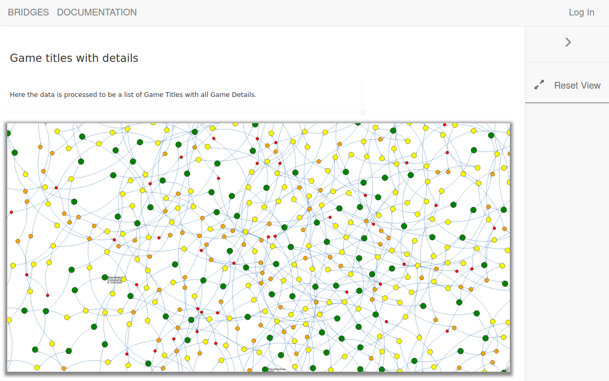

# CPTR 242: Project -- Linked Lists

## Problem Overview

This project will use the BRIDGES API with a game review dataset from IGN.
You be building a sorted linked list using BRIDGES elements, which will enable you to visualize the data structure you are constructing and testing.
Note that the visualization will also be a means to debug your program, as it will let you view your data structure and its contents after each operation.
This dataset contains a collection of game reviews at IGN and is adapted from Reddit User: CDanger (Twitter: @coreyaustinhere), who scraped the data from IGN's website.
The driver will be managing the game review details so you can focus on adding operations to the sorted list.



## Learning Objectives

* Understanding of linked list structure
* Able to read C++ library documentation
* Able to create complete tests
* Visualize the data structure using the BRIDGES API

## Resources

* Bridges Site: <http://bridgesuncc.github.io/>
  * Getting Started: <http://bridgesuncc.github.io/bridges_setup.html>
  * API Documentation: <http://bridgesuncc.github.io/doc/cxx-api/current/html/index.html>

## Solution Specifications

Your solution to this problem must meet the following criteria.

1. Implement __putGame__, __getGame__, __deleteGame__, __resetList__, __getNextGame__, and __emptyList__ for the linked sorted list implementation in _GameList.cpp_.
   The class header and function stubs have been given to you.
   Please read the header file for a detailed description of the functions.
1. Update the list visualization to change the node size and color based on the rating.
   Use the rating table to determine the color and size below.
1. Submitty will be used to grade through automated tests and a TA looking at your visualizations.


## Rating System

The rating table shows how to select the color and size.
Not the color string can be used to select the color.

| **Rating** | **Color** | **Size** |
|------------|-----------|----------|
| r > 8      | green     | 40.0f    |
| 8 => r > 6 | yellow    | 30.0f    |
| 6 => r > 4 | orange    | 20.0f    |
| 4 => r     | red       | 10.0f    |

## Test Driver

The project continues to follow the testing structure from prior homework.
The Submitty tests are based on this test driver.

These are the complete menu options available:

```txt
Menu options
 - Menu.                  Display menu.
 - PrintList.             Prints list.
 - MakeEmpty.             Returns the list to the empty state.
 - IsFull.                Returns whether list is full.
 - GetLength.             Returns length of list.
 - GetGame <string>.      Retrieves list element whose key matches item's key.
 - PutGame <string>.      Add item to list.
 - DeleteGame <string>.   Deletes the element whose key matches item's key.
 - ResetList.             Reinitializes current position of iteration through list.
 - GetNextGame.           Gets next element in list.
 - Visualize.             Builds the bridges visualization and prints the URL.
 - AddAll.                Adds all Games to the list.
 - AddX <count>.          Adds X number of Games to the list.
 - Quit.                  Quit application.
```

Here is a sample set of input to get you started.

```txt
PutGame Minecraft
PutGame Tetris
GetLength
Visualize
PrintList
AddX 100
GetLength
Quit
```

Expected output:

```sh
Example
Game Minecraft was inserted into the list.
Game Tetris was inserted into the list.
List has 2 items.
Success: Assignment posted to the server. 
Check out your visualization at:

http://bridges-clone.herokuapp.com/assignments/24210/prestoncarman

List was visualized.
PrintList: 
  1. Minecraft
  2. Tetris
Added 100 games.
List has 102 items.
Quit
Testing completed.
```

log.txt

```txt
PutGame command number 1 completed.
PutGame command number 2 completed.
GetLength command number 3 completed.
Visualize command number 4 completed.
PrintList command number 5 completed.
AddX command number 6 completed.
GetLength command number 7 completed.
```


* Create alternate tests to cover all the test functions
* Create a user-input test file to allow for consistent and repeatable testing

## Sign Up For BRIDGES

Please sign up for a BRIDGES account at [Bridges Sign Up](http://bridges-cs.herokuapp.com/signup).
Once you have an account, put your username and the API Sha1 key in the `bridges_user.h` file.

1. Sign up for [bridges](http://bridges-cs.herokuapp.com/signup)
1. Navigate to your profile.
1. Put your __User Name__ in `bridges_user.h` file
1. Put your __API Sha1 Key__ in `bridges_user.h` file

These steps are needed to make sure you have access to the Game data and visualization for the project.

## Setup Local IDE

Follow the [Bridges Setup Directions](http://bridgesuncc.github.io/bridges_setup.html) to configure your system.
Please install the libraries in your `student242/include` folder for the `make` file to work properly.
(If you install it in another directory, the make file will need to be altered.)

A script has been created for Code.CS.
If you are using a different IDE, take a look at the website for setup details.
You can also look at supplied setup script to see the exact commands which are being used by Code.CS.

If you are using Code.CS, do the following:

```sh
cd student242
./setup_bridges_on_code-cs.sh
```

## Compiling List Implementations

A _make_ file has been provided to help with compiling your code.
Simply run ```make``` to compile your code after the setup has been completed.
Then execute ```./a.out```.
These commands have been tested on Code.CS.

```sh
make
./a.out
```

The build files can be cleaned up by running ```make clean```.

## Tips

1. In this project, you will get familiar with reading library documentation.
   The Bridges project has fairly good documentation and you will need it to figure out the available options for completing this assignment.
2. Your IDE may show red marks since it does not know about the BRIDGES library.
   You will still be able to build and run the software, even with these marks.
   Try compiling to see if there is an issue.
   You may find instructions online on how to tell your IDE where the Bridges source code can be found.
